# F1 Unleashed — Documentation

A Formula 1 live-timing and replay application with synchronised audio commentary, multi-source analysis, and per-session deep dives.

**First Release**: 1.0.0 "Monte Carlo", 7 June 2026 — it marks the day of the 2026 Monaco Grand Prix; McLaren's 1000th Grand Prix start; and the 60th anniversary of Mclaren's first-ever Formula 1 race, the 1966 Monaco Grand Prix.

**Current release**: 2.0.0 "Spa-Francorchamps", 2026-07-16 — on the eve of the Belgian Grand Prix weekend. See [Release history](#release-history).

The server listens on port **1950**, an homage to the first F1 World Championship.

This document describes what the application does and how it's structured. For install
instructions see [README.md](README.md). For an end-user walkthrough, the in-app **user
guide** (served at `/help`, split into the main window + one page per session type) is the
place to start.

> **Disclaimer**: F1Unleashed is an unofficial, non-commercial project. It is not associated with, endorsed by, or affiliated with Formula 1, Formula One Licensing B.V., Formula One Management, or the FIA. It is a personal project, to improve my own experience while watching Formula 1, and is not intended to infringe on any organisation's copyright or trademarks.

>F1, FORMULA 1, FORMULA ONE, GRAND PRIX and related marks are trademarks of Formula One Licensing B.V. Team, driver, sponsor, and tyre-supplier (e.g. Pirelli) names and marks belong to their respective owners; they are used here only descriptively.

This project is intended for personal and educational use only, and solely by persons legally allowed to stream and download live timing data and Formula 1 TV coverage.

While Formula 1's timing data is publicly available (with some limitations), it's still protected by copyright and its distribution is almost certainly a violation of copyright law in most jurisdictions.

Distribution of the processed data is therefore not allowed. Streaming of the client UI to others is not permitted. Sharing of formula1.com credentials is a violation of Formula 1's usage policy. 


## Contents

- [What it does](#what-it-does)
- [Installation & first-run configuration](#installation--first-run-configuration)
- [The interface](#the-interface)
- [Data stream + visuals](#data-stream--visuals)
- [Audio stream](#audio-stream)
- [Team radio](#team-radio)
- [Status footer + data-health monitor](#status-footer--data-health-monitor)
- [Weather — current conditions + forecast](#weather--current-conditions--forecast)
- [Sync to a TV broadcast](#sync-to-a-tv-broadcast)
- [Login process](#login-process)
- [Settings](#settings)
- [Caching](#caching)
- [Replays vs live](#replays-vs-live)
- [Architecture](#architecture)
- [Power-user & developer notes](#power-user--developer-notes)
- [Release history](#release-history)
- [Future developments](#future-developments)

---


## What it does

F1Unleashed connects to the F1 SignalR feed (live) or replays cached session data (historic), runs pre-processing on the raw timing stream, and visualises everything in a browser. It captures broadcast audio in parallel, aligns it to the data stream, and ships a session-aware UI tuned per session type (Practice / Qualifying / Race).

Lap classification (PUSH / SLOW / OUT / PIT / STOP / CHECKERED) is derived from telemetry and lap-time deltas — a lap is SLOW when, up to 90% of the way round the lap, its elapsed-to-here is both >10% over **and** at least 2 s slower than the reference lap to the same point. Race laps also receive PIT / OUT / STOP / CHECKERED labels; only timed (green) race laps are left unlabelled.

---

## Installation & first-run configuration

### Requirements

- **Python 3.13** (a venv is recommended).
- **`ffmpeg` + `ffprobe`** on the `PATH` (commentary HLS capture + duration probing).
- A **formula1.com subscription** for live sessions and premium audio/telemetry (downloading
  historic timing data may work without one).
- A modern browser — **Firefox** is the reference; others should work.
- macOS is the tested platform; Linux/Windows should run but the live-sync path is less
  exercised.

### Install

```bash
git clone <repo-url> f1unleashed && cd f1unleashed
python3.13 -m venv venv && source venv/bin/activate
pip install -r requirements.txt
./f1unleashed.sh start                 # server on http://localhost:1950
```

On **Windows**, use `f1unleashed.bat start` (which wraps `f1unleashed.ps1` with
`-ExecutionPolicy Bypass`, same port 1950) in place of `./f1unleashed.sh start`.

There is **no `.env`** — every setting has a default, so the app runs immediately. Open
`http://localhost:1950`.

### First-run configuration

1. **Log in** — click **Login** on the home page (or run `python -m app.cli.login`). A browser
   window handles the F1 login; the token lasts ~72 h. Required for live sessions and full data.
2. **Open the settings dialog** — the gear on the **home-page footer** (right side). At minimum,
   consider setting:
   - **Rain-radar key** (`rainbowAiApiKey`) — needed for the precipitation overlay; the free
     Rainbow.ai tier is enough. Without it, everything works except the rain radar.
   - **Cache location** (`cacheDir`) — point it at a roomy drive if you'll keep many sessions.
   - **Notifications** (`ntfy.webhookUrl`) — set a webhook (ntfy/Discord/Slack) to get
     session-live / pre-session / token-expiry alerts; add favourite drivers/teams under
     `alerts`.
   - **Per-session capture toggles** — leave commentary/team-radio/keep-files on unless you want
     to save disk or skip audio for a session type.
   See [Settings](#settings) for the full reference and defaults.
3. **Get some data** — on the home page, open a past event, pick a session, and **Download** it
   (runs in the background); then **Open** to replay. Live sessions capture automatically. **Note**: past audio comentary, team radio and weather forecasts and radar images are not downloaded. Only the historic live timing data is available to download.

---

## The interface

A tour of what each part of the UI shows and does.

### Main page

<p align="center">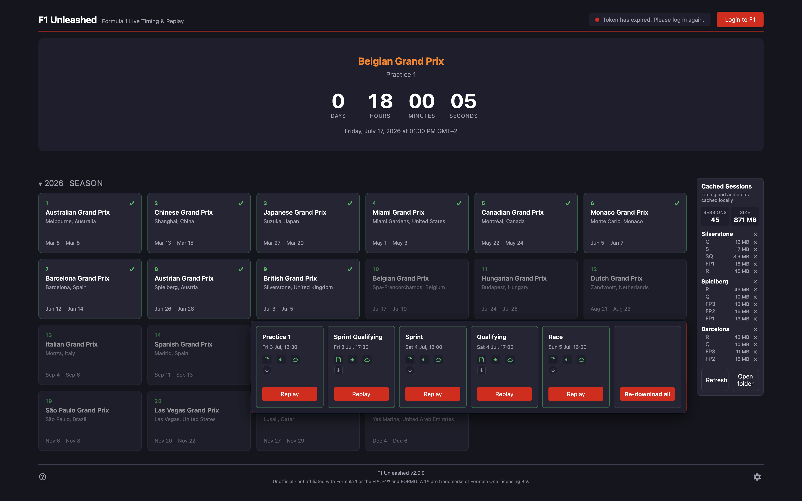</p>

The landing page lists every Grand Prix weekend in the current season and the prior weekend's cached sessions, plus controls for login and live-capture status.

- **Race calendar** — one card per event. Past events are clickable and open the session popover; upcoming events appear faded.
- **Session popover** — opens beneath the event card and lists the FP / Q / Sprint / Race sessions for that weekend. Each session row offers **Download** (pull the raw F1 timing data for a finished session — one-shot, runs in the background) and **Open** (launch the session view at speed 1×).
- **Cached sessions** - offers an overview of all cached data and allows selectively deleting cached files for a particular event or session.
- **Login button** — opens the browser-based F1 login. After login the token is stored at `~/Library/Application Support/fastf1/f1auth.json` for ~72 h.
- **Live-capture status** — shows when a live session is being captured automatically by the adaptive session monitor.
- **Footer** — the app name and version sit in the centre, a Help (?) icon on the left opens this documentation page, and a settings gear on the right opens the settings dialog (see [Settings](#settings)).

### Practice view

<p align="center">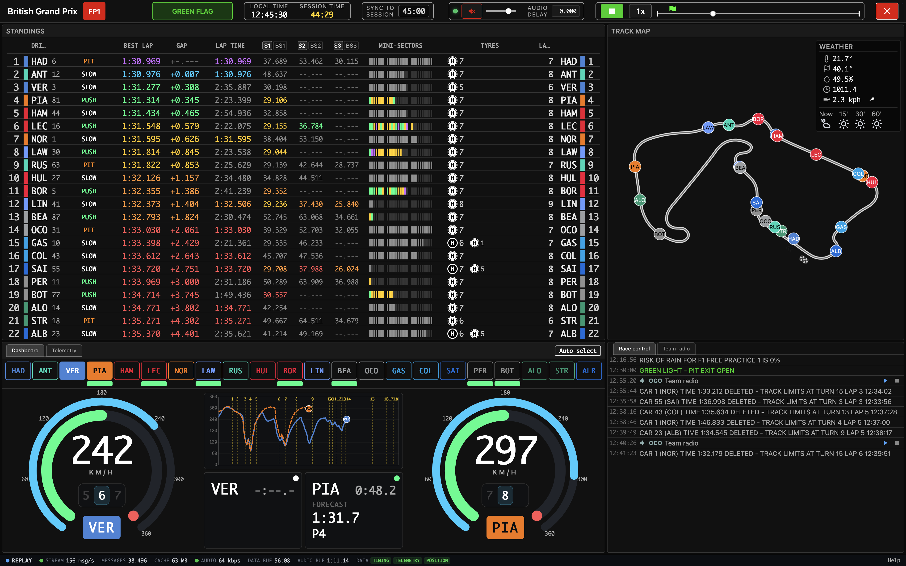</p>


Optimised for free practice: lots of timed-lap context, pace classification, tyre history, telemetry comparison.

- **Header** — local + session clock, track status, playback controls, audio controls.
- **Standings** — position, driver, lap type, best lap, gap to leader, mini-sectors, S1/S2/S3 times, last lap time, tyre history, number of laps.
- **Track map** — track SVG with the position of each driver, the Current Conditions weather panel, the rain-radar overlay, and a short-range weather forecast widget (In 15' / 30' / 60', with rain probability for wet slots).
- **Telemetry** — opens in the two-driver **Dashboard** view (see [Dashboard view](#dashboard-view)); a **Telemetry** toggle switches to multi-driver SPD / RPM / GEAR / THR-BRK traces with a per-driver lap list. The trace view can show the live trace, last lap, best lap, and a selection of laps for comparison; in qualifying, part tabs (Q1/Q2/Q3) show one part's laps at a time. Corner labels along the x-axis match the circuit map.
- **Race control** — RC message stream (with team-radio clips interleaved by time) plus a **Team Radio** tab listing every clip. Each clip has Play / Stop buttons; playing a clip ducks the commentary for its duration and then restores it.

<p align="center">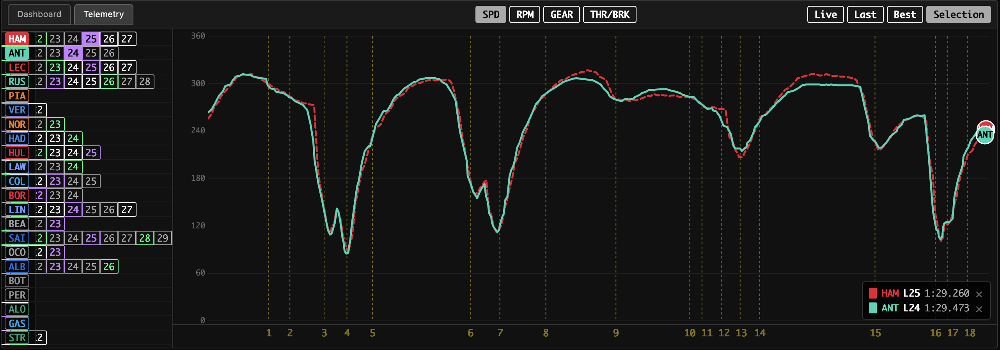</p>


### Qualifying view

<p align="center">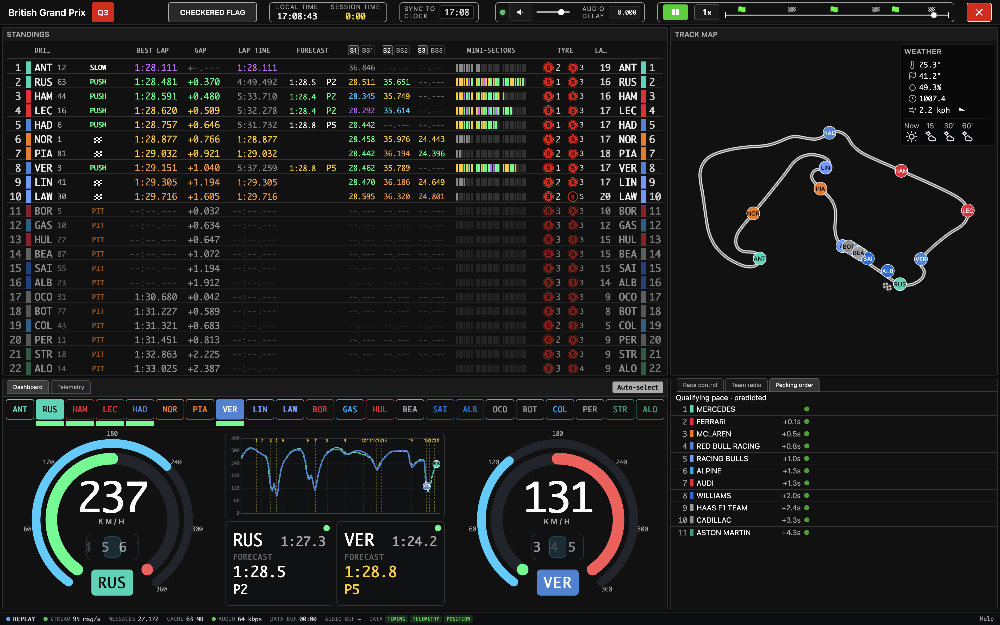</p>


Practice-like layout plus Q-specific features: knockout-zone indicator, lap-time prediction, and predicted qualifying pace per team.

- **Standings** — for drivers in the elimination zone, the gap is shown to the driver on the bubble. Only the current tyre is shown. During a qualifying attempt the driver's delta to their best lap is shown live with the positions it would gain; once the lap completes, the actual delta and positions gained are shown.
- **Pecking order** — a tab in the race-control tile shows the predicted ranking of teams and their gaps.

### Race view

<p align="center"></p>


Optimised for the race: gaps to leader and to the car ahead, tyre history, penalties, and championship standings.

- **Standings** — like the Practice view but showing gaps to leader and to the car ahead. Also shows blue flags, penalties (under investigation and imposed), and black-and-white flags.
- **Race control** — tabs, in order: **Race control** (live RC message stream with team-radio clips interleaved by time); **Team Radio** (every captured clip, each with Play / Stop; playing a clip ducks the commentary); **Pecking order** (pre-race predicted team rank and pace); **Championship** (provisional driver + constructor standings updated from the current order); **Pit stops** (every in-race stop with stationary time, total time lost, SC/VSC context, position change and rejoin traffic).


<p align="center">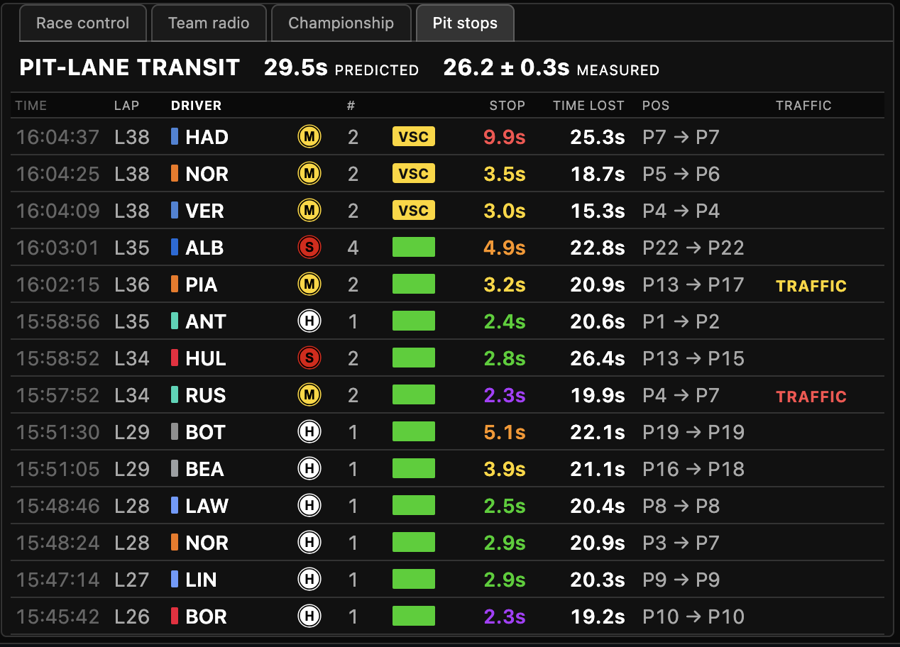</p>


### Common controls


<p align="center">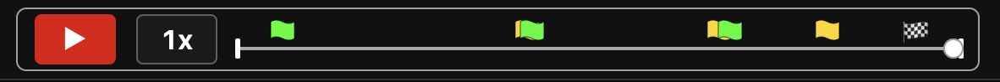</p>


- **Scrubber** — drag to seek to any point in the session. Click an event marker to jump to ~60 s before that event. Marked events: session start; session finished; safety car / virtual safety car; green flags; red flags.
- **LIVE button** (live sessions only) — replaces the speed button; red when at the live edge, black when behind. Click to snap to the latest available state.
- **Speed** — 1× during live; 1×–10× during replay (cycles 1× / 2× / 5× / 10×).
- **Audio controls** — mute, volume, a **Delay** box (`ss.SSS`; manual fallback offset — positive plays the commentary later, negative earlier), and a traffic light (green = audio in sync; yellow = seeking / loading; red = audio expected but not ready; a genuine content gap shows no light). By default Firefox prevents audio auto-play without user intervention. Click the Mute/Unmute button to enable audio.
- **Status footer** — see [Status footer + data-health monitor](#status-footer-data-health-monitor).
- **SYNC TO** — seek the data clock to a shared reference marker to line up with a TV broadcast; see [Sync to a TV broadcast](#sync-to-a-tv-broadcast).
- **Player help** — a link on the right of the status footer opens a modal with the playback-control reference and keyboard shortcuts; it is a client-only overlay, so it does not pause playback.

<p align="center">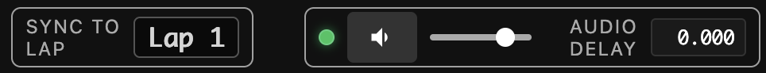</p>


### Dashboard view

The telemetry tile **opens in the Dashboard view by default**; a **Telemetry** toggle switches
to the multi-driver trace chart. The Dashboard is a focused **two-driver** view, tuned per
session type:

- **Practice / Qualifying** — live gauges per driver plus a mini telemetry (speed-trace) viewer.
  The stopwatch shows a **lap-time forecast** (label `FORECAST`) while a lap is
  running, switching to `LAP TIME` once the lap is confirmed.

<p align="center">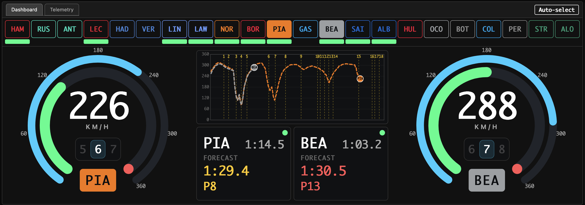</p>

- **Race** — a battle panel per driver (TLA, position, the interval between the pair, a pit
  indicator, tyre compound/age, and a close-gap highlight) plus a **zoomed, self-centring mini
  track-map** (`track_map.js` secondary SVG instance) that follows the chasing car.

<p align="center">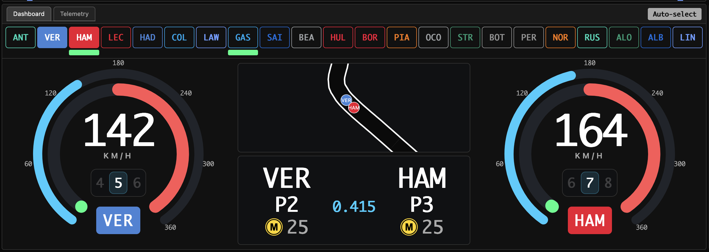</p>

**Auto-select** (`DashboardAutoSelectProcessor`, `dashAutoSelect` topic; on by default) picks
the two drivers most worth watching and re-picks as the session evolves: closest to finishing
a push lap (practice); the at-risk drivers on a push lap (Q1/Q2); predicted/current top-5 (Q3);
the frontmost close battle (race). A manual TLA click hands control back to the user (auto
off); the picker holds a changed pick for a few seconds of session time so a just-completed lap
can be read before switching. The two-driver panels are computed by `DashboardInfoProcessor`
(`dashInfo:{num}` topic) — server-computed, client-rendered, as everywhere else.

---

## Data stream + visuals

The data stream is a sequence of typed messages on a server-side message bus, replayed from a SQLite cache or streamed live.

**Visuals** 

| Tile | What it shows |
|------|----------------|
| Header | Local time, session clock, track status, playback controls, audio controls (= mute, volume, sync indicator) |
| Standings | Position; time gaps; penalty + flag indicators (R); timing sectors; lap classifications; tyre history, etc. |
| Track map | Circuit SVG with per-driver positions, yellow-flag sector overlays, Current Conditions weather, rain radar overlay, and a short-range weather forecast widget |
| Telemetry | Opens in the two-driver **Dashboard** view; a **Telemetry** toggle shows the multi-driver speed / RPM / gear / throttle+brake (one combined channel) traces with lap selection and lap history |
| Race control | Tabs: Race control (RC message stream + interleaved team-radio clips); Team Radio; Pecking order; Championship; Pit stops (race) |
| Status footer | A slim bar at the bottom of the player: live/replay indicator, stream throughput (msg/s), total messages, on-disk cache size, audio bitrate, data/audio buffered ahead of the playhead, live download speeds, and the data-health monitor (timing / telemetry / position) |

The frontend listens via a message bus pattern:

```javascript
messageBus.on('TopicName', (data, offsetMs) => {
    // The 2nd arg is offset_ms — a NUMBER (ms from session start), NOT a Date.
    // Read the current playback clock from the global messageBus.clockTime (a Date):
    const now = messageBus.clockTime.getTime();
});
```

Read the clock only from `messageBus.clockTime`; never `Date.now()`. (Calling `.getTime()` on the handler's 2nd argument would throw — it's a number.)

---

## Audio stream

Audio commentary from `rdio.formula1.com` is captured as HLS (`ffmpeg -c copy`), written to disk as `commentary.aac`, and stored alongside the session data. The browser plays it through **MediaSource Extensions**: the raw ADTS-AAC bytes are range-fetched and transmuxed to fMP4 in-browser (`static/js/lib/aac_fmp4.js`), so live and replay share one natively-seekable playback path.

**Sync rules:**
- **Byte-0 anchoring.** `audio_info.json:start_utc` is pinned to the broadcast `PROGRAM-DATE-TIME` (UTC) of the *exact first segment ffmpeg captured* — identified from ffmpeg's own log, so it is race-free regardless of when capture started. A background side-car (`app/services/audio_pdt_tracker.py`) reads the HLS playlist to establish and persist this anchor, identically for live and replay.
- The client maps the data clock to an audio position via that per-segment anchor (`clockToAudioSec`), so the two stay aligned across reconnects, HLS rolling-window drift, and ffmpeg jitter. A capture restart produces additional segments; the server serves them as one virtual concatenation so the mapping still holds.
- **Live-edge cap.** During live capture the data clock is held to whichever stream is lagging — `min(data_edge, audio_edge) − buffer` — where the audio edge is the *captured-file* edge (byte-0 anchor + the duration of the bytes ffmpeg has written), tracked in `pdt_map.jsonl`. This keeps audio available at the live tail; if the audio edge goes stale (a capture stall) the cap releases so the data clock keeps flowing.

The audio controls in the header are: a traffic light (sync state), mute, volume, and a **Delay** box (`ss.SSS`, ±) — a manual fallback offset, rarely needed now that the byte-0 anchor is automatic.

During live capture a watchdog restarts the commentary ffmpeg process if its HLS download stalls (= the output file stops growing). Audio capture stops on `SessionStatus=Ends` (with a max-duration backstop) — there is no separate silence-based end detector.

---

## Team radio

F1 `TeamRadio` messages carry `Captures` of `{Utc, RacingNumber, Path}`, where `Path` points at an mp3 on the livetiming CDN. During live capture the clips are downloaded and cached to `{session}/TeamRadio/*.mp3` (existing sessions can be backfilled from `live.jsonl`).

- `TeamRadioProcessor` emits a `teamRadio` topic (`{num, file, utc}`) for each clip as it airs live, at the clip's broadcast `Utc`. The pre-session backlog carried on the initial subscribe is downloaded but not emitted for playback.
- In the race-control tile a **Team Radio** tab (between Race control and Pecking order) lists every clip; clips are also interleaved into the Race control message stream by time. Each entry shows an audio icon, the driver TLA, "Team radio", and Play / Stop buttons.
- Playing a clip **ducks** the commentary (mutes it for the duration of the clip, then restores it). Auto-play when a clip airs during replay is settings-gated (default off); otherwise clips play on demand via the Play button.
- Clips are served by `GET /api/v1/livetiming/teamradio/{session}/{file}`.

Transcription is not implemented (deferred).

<p align="center">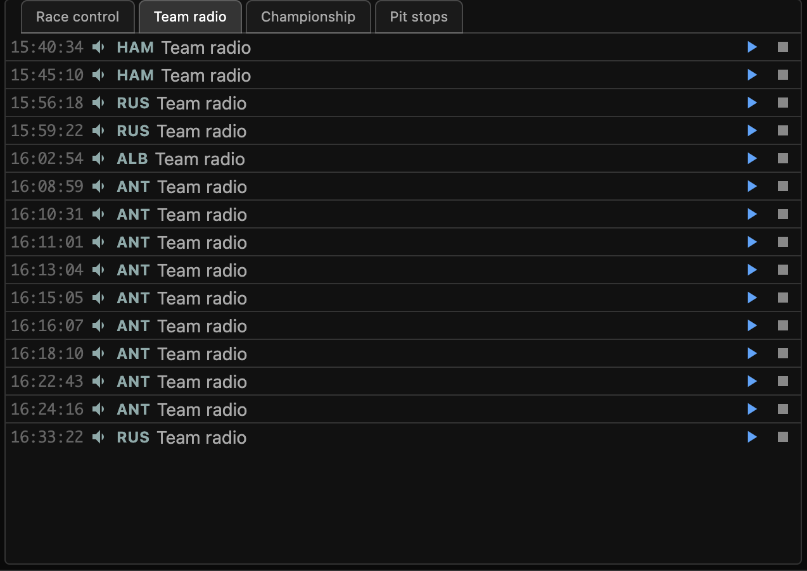</p>

---

## Status footer + data-health monitor

A slim status bar (= about half the header height) sits at the bottom of the session/player window. It shows the live/replay indicator, stream throughput (msg/s) with a traffic light, total messages, on-disk cache size, the commentary audio bitrate, the data and audio buffered ahead of the playhead (Data buf / Audio buf), and — for live sessions only — the data and audio download speeds.

<p align="center">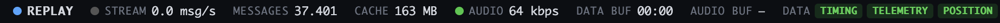</p>

It also hosts the **data-health monitor**: three coloured boxes — TIMING, TELEMETRY, POSITION — driven by the server-side `DataHealthProcessor` (`dataHealth` topic). Only drivers currently **on track** count (status TRACK / OUT; RET / STOP / PIT / FINISHED / DSQ are excluded, since a parked or retired car legitimately stops sending data).

- **TIMING** is all-or-nothing: red only if the whole `TimingData` feed has stopped (any `TimingData` arriving = green); it underpins everything else.
- **TELEMETRY** and **POSITION** are coloured by the fraction of on-track drivers affected: >50% red, >25–50% orange, >0–25% yellow, none green. Telemetry counts as "invalid" when throttle/brake exceed 100 or speed is 0 while the car is position-tracked, and "missing" when no recent `CarData` has arrived; position counts as stale when `Position` updates stop.
- Assessment is **green-gated**: red / SC / VSC pause the data legitimately, and a short grace window after green resumes lets the streams catch up before any stream is flagged.

---

## Weather — current conditions + forecast

The weather tile header is **Current Conditions**. The data is drawn from three sources:

- **Sky-condition icon** — from Open-Meteo (`/api/v1/weather`, hourly `weather_code` + `is_day`), indexed by the playback clock.
- **Live measurements** — temperature, track temperature, humidity, pressure and wind come from the F1 `WeatherData` feed.
- **Rain radar** — the precipitation overlay only; Rainbow.ai is used solely for the radar imagery, not the condition icon.

A **Weather Forecast** widget overlays the top-right of the radar/weather tile, showing the In 15' / 30' / 60' forecast condition icons and a rain probability (%) for wet slots.

The forecast is **captured live**: `ForecastCapture` (`app/services/weather_forecast.py`) fetches the Open-Meteo `minutely_15` forecast (`weather_code` + `precipitation_probability`) every 10 minutes during a live session and appends snapshots to `{session}/weather_forecast.jsonl`. Because Open-Meteo does not archive past forecasts, capturing live is the only way to replay what was predicted. Replay reads the snapshots via `GET /api/v1/weather/forecast?session=…` and indexes them by the playback clock.

<p align="center">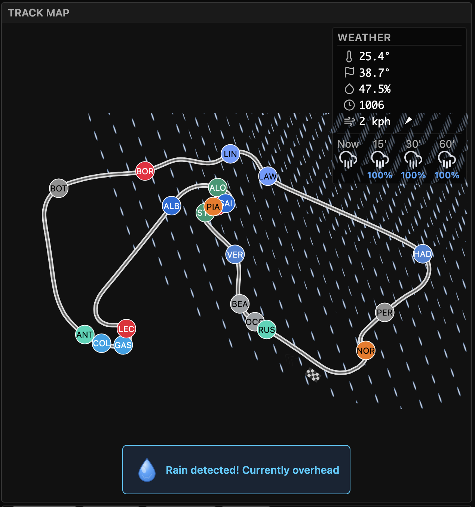</p>


---

## Sync to a TV broadcast

Line the data clock up with a live TV broadcast you are watching alongside. There is **no
screen-sharing or OCR** — you sync to a shared reference point that the TV also shows, then
fine-tune by ear/eye. Audio stays auto-anchored to the data clock via the PDT anchor, so you
only ever move the *data* clock.

**SYNC TO** (header) — a single button that seeks to the **previous marker at/before the
playhead**, with a small label showing the mode and target. Markers are context-dependent:

- **Pre/post-session** — the previous whole **wall-clock minute** (`hh:MM`); mode `CLOCK`.
- **Practice / Qualifying running** — the previous whole **session-clock minute** (`MM:ss`);
  mode `CLOCK`.
- **Race** — the start of the **current lap** (`Lap N`); mode `LAP`. The **Lap 1** marker
  targets **lights-out** and is the one exception that can seek *forward* of the playhead (so
  it also works during the pre-race window / when the TV is ahead). The button is greyed when
  its marker is beyond the playhead.

**Keyboard**

- **ENTER** — jump to the current SYNC TO marker and resume playback if paused.
- **`←` / `→`** — skip 10 s back / forward (works playing or paused).
- **`+` / `=`** — the TV is ahead: nudge the data forward ~0.5 s.
- **`−`** — the TV is behind: pause ~0.1 s so the picture catches up.
- **Space** — play / pause both streams. 
- **M** — mute/unmute.

**How to sync**

- **Practice / Qualifying** — you can sync to an exact minute (the track clock or the session
  clock) by pressing **ENTER**. The app must be running **ahead** of the TV, so it can snap
  *back* to the minute the moment the TV reaches it.
- **Race** — get a **rough** sync before the race starts (snap to a whole minute as above), then
  an **exact** sync at the **start of the formation lap** — again, the app needs to be ahead of
  the TV to snap-sync. For a **near-perfect** result, snap-sync at **lights-out**: press ENTER
  the instant the five red lights go out.
- **Fine-tuning** — even with best efforts, perfect sync is very hard. Use the **`+` / `−`** keys
  for sub-second accuracy, until the engine sounds match what's showing on the video.

---

## Login process

Access to non-public F1 data (live session feeds, premium audio, telemetry) requires a `formula1.com` subscription and login token.

- Login is **browser-based only** (`python -m app.cli.login` or the login button on the homepage launches `pywebview`).
- Tokens are stored at `~/Library/Application Support/fastf1/f1auth.json` and last about 72 hours.
- The app monitors token expiry. If the token expires within 24 hours **and** the next session starts within 6 hours before expiry, a notification is sent via the configured webhook (= e.g. ntfy).

---

## Settings

All runtime configuration lives in a single JSON store, `settings.json`, under the OS data home (`app/settings.py`). `.env` and `python-dotenv` are gone — **every value has a default, so the app runs out of the box** — and the store is edited via an in-app **settings dialog** reached from the gear on the **home-page footer** (right side) only, not the session window.

**Full reference** (key → default → purpose):

| Setting | Default | Purpose / when to change |
|---------|---------|--------------------------|
| `debug` | `false` | Keep transient/ephemeral artefacts (scratch DBs, temp files) instead of deleting them on disconnect. Turn on only when troubleshooting. |
| `cacheDir` | `""` (OS data home) | The livetiming-cache root. Point it at a large/external drive if you cache many sessions (see note below). |
| `rainbowAiApiKey` | `""` | Rainbow.ai key for the precipitation-radar overlay. **Set this to see the rain radar**; without it the radar layer is simply absent (everything else works). Free tier (30k calls/month) is plenty. |
| `audio.{practice,qualifying,race}` | `true` | Per session type: download + play the commentary audio. Turn a type off to skip commentary capture/playback for it. |
| `teamRadio.{…}` | `true` | Per session type: download team-radio clips. |
| `keepFiles.{…}` | `true` | Per session type: keep downloaded files after the session (turn off to auto-clean and save disk). |
| `teamRadioAutoplay` | `false` | Auto-play radio clips as they air during replay. Off = play on demand from the Team Radio tab. |
| `ntfy.webhookUrl` | `""` | Push-notification endpoint (ntfy / Discord / Slack / generic). **Set this to receive alerts**; empty = no notifications. |
| `ntfy.sessionLive` | `true` | Notify when a session goes live. |
| `ntfy.preSession` | `true` | Notify before a session starts. |
| `ntfy.preSessionLeadMinutes` | `60` | How many minutes ahead the pre-session alert fires. |
| `ntfy.tokenExpiry` | `true` | Warn when the F1 login token is close to expiring. |
| `ntfy.repeat` | `false` | Repeat notifications rather than fire once. |
| `alerts.favouriteDrivers` | `[]` | TLAs or car numbers to highlight (case-insensitive). |
| `alerts.favouriteTeams` | `[]` | Team names to highlight (substring match, case-insensitive). |
| `auth.expiryWarningHours` | `24` | Warn when the token expires within this many hours. |
| `auth.expiryCheckIntervalSeconds` | `3600` | How often to check token expiry. |

The `cacheDir` setting points **directly** at the livetiming-cache root: the chosen folder holds the season directories (`2026/`, `2025/`, …) with no extra `livetiming_cache` level. Everything else — `settings.json`, `known_topics.json`, `rainbow_usage.json`, `tmp`, `analysis`, and the weather-radar cache — stays at the fixed OS data home. Changing the cache location offers to **move** the existing cache and requires a restart; a native folder-picker is provided.

The settings API: `GET`/`PUT /api/v1/settings`, `POST /api/v1/settings/pick-folder` (native folder picker), `POST /api/v1/settings/cache-location` (relocate + move).

---

## Caching

Every captured session is stored on disk under an OS-appropriate data directory
— Windows `%LOCALAPPDATA%\F1Unleashed`, macOS `~/Library/Application Support/
F1Unleashed`, Linux `$XDG_DATA_HOME/f1unleashed`. The livetiming cache can be
redirected elsewhere with the `cacheDir` setting (see Settings); the rest of the
data home is fixed.

```
{cache-dir}/{year}/{MeetingKey}_{Location}/{SessionKey}_{SessionName}/
    live.jsonl              # one JSON message per line, payload-timestamp-ordered
    subscribe.json          # initial state snapshot at SignalR connect
    commentary.aac          # transcoded audio
    audio_info.json         # audio-clock anchor
    TeamRadio/*.mp3         # captured team-radio clips
    weather_forecast.jsonl  # 15-min forecast snapshots captured live (for replay)
```

Pre-processing reads `live.jsonl` once (or streams live), runs the processor chain, and builds a transient pre-processed SQLite DB under `{data-dir}/tmp/` (one per session, built on demand and removed on disconnect). Formula 1 timing messages only contain changes to previous data and as such make it hard to skip playback forwards/backwards. This pre-processing step makes every message history aware, and that allows near instant playback skip.

The data directory holds:

* **livetiming_cache**: Formula 1's streamed data and audio
* **weather_radar_cache**: precipitation radar images to re-use on replays
* **analysis**: supplemental data produced by the backend processing
* **tmp**: transient per-session pre-processed DBs

### Storage footprint

Approximate on-disk sizes per session (they scale with session length, incidents,
and how many cars are running):

| Component | Practice / Qualifying / Sprint / Sprint-Q | Race |
|---|---|---|
| `live.jsonl` + `subscribe.json` + weather | ~20 MB | ~50 MB |
| `commentary.aac` (64 kbps ≈ 29 MB per broadcast-hour) | ~30 MB (~1 h) | ~60 MB (~2 h) |

Per **weekend** (≈ 3 practice + qualifying + race, or the sprint equivalent):

| | Data | Audio | Total |
|---|---|---|---|
| Everything | ~150 MB | ~150 MB | **~300 MB** |
| Skipping audio | ~150 MB | — | **~150 MB** |

The **transient pre-processed DB** under `tmp/` adds **~100–200 MB per session
while a client is viewing it**, but it's scratch — built on demand and deleted on
disconnect, so it never accumulates (unless `debug` is on, below).

**Keep / skip guidance:**
- **`keepFiles.{type}`** (default on) — turn off for a session type to auto-clean
  its downloaded files (jsonl, audio, radio) after the session, saving disk.
- **Skip audio** — the largest single component; not capturing it (or deleting
  `commentary.aac`) roughly halves a weekend's footprint (~300 MB → ~150 MB).
- **`debug`** (default off) — keeps the transient scratch DB and temp files
  instead of deleting them on disconnect. For troubleshooting only; with it on the
  per-session DBs persist and accumulate (~100–200 MB each).

---

## Replays vs live

**Live:**
- Triggered automatically when a live session is active.
- SignalR connection writes to `live.jsonl` in append mode.
- The client streams over a WebSocket.
- Speed control is locked to 1×.
- "Live" indicator pinned to the latest data; user can rewind freely and then skip forwards to Live.

**Replay:**
- Loads processed data for the chosen cached session.
- The server replays messages at adjustable speed (1× – 10×).
- Seeking lands on requested timestamp.
- Audio follows the data clock automatically via the byte-0 PDT anchor; native (MSE) seeking lands audio together with the data.

The adaptive live-session monitor polls F1's API at intervals depending on time-to-next-session (= 60 min when > 2 h away, 5 min when 1–2 h away, 60 s when < 1 h away) so live capture starts automatically with no user action.

---

## Architecture

### Data flow

```
F1 SignalR (live)   ──→ F1SignalRClient    ──→ live.jsonl (disk)
F1 CDN (historical) ──→ LiveTimingFetcher  ──→ live.jsonl (disk)
                                                  │
                                         SessionPreProcessor
                                        (reads JSONL, runs processors,
                                         writes session.db)
                                                  │
                                             session.db
                                          (SQLite: messages table
                                           indexed by topic + offset_ms)
                                                  │
                                            SessionEngine
                                         (DB-driven playback,
                                          instant seeking via
                                          DB lookups)
                                                  │
                                           WebSocket clients
                                          (browser components)
```

### Key components

**Data acquisition**

| Component | File | Purpose |
|-----------|------|---------|
| `F1SignalRClient` | `app/services/signalr_client.py` | Live SignalR connection; writes messages to `live.jsonl` |
| `LiveTimingFetcher` | `app/services/livetiming_fetcher.py` | Downloads historical sessions from F1 CDN |
| `LiveCaptureService` | `app/services/live_capture.py` | Live capture lifecycle; audio HLS → AAC via ffmpeg |
| Live Session Monitor | `app/main.py` | Adaptive poll of F1 API; auto-starts capture |

**Pre-processing pipeline**

| Component | File | Purpose |
|-----------|------|---------|
| `SessionPreProcessor` | `app/processing/preprocessor.py` | Main pipeline: reads JSONL, gates on SessionInfo, filters stale data, runs processors, writes session.db |
| `SessionDatabase` | `app/processing/database.py` | SQLite per session: `messages` (offset_ms, topic, data JSON) + `processing_meta` |
| `FileReader` | `app/processing/file_reader.py` | Reads JSONL with decompression + reorder buffer + tail-follow for live |
| `SessionMessageBus` | `app/processing/message_bus.py` | Python pub/sub between processors |


**Processors**

Each processor subscribes to raw F1 topics and emits processed messages. Per-driver messages use the `topic:driverNum` format.

| Processor | Subscribes to | Emits |
|-----------|----------------|-------|
| `SessionInfoProcessor` | SessionInfo, SessionData | `sessionInfo` (type, name, status, gmtOffset), `meetingName`, `trackCircuit`, `sessionBadge`, `qualifyingPart` |
| `ClockProcessor` | ExtrapolatedClock, SessionInfo | `clock` (utc, sessionTime, clockStatus) |
| `DriverListProcessor` | DriverList | `driverList` |
| `StandingsProcessor` | TimingData, DriverList, … | `standings`, `qualifyingSegment` |
| `DriverStatusProcessor` | TimingData, trackStatus, RaceControlMessages, qualifyingPart | `driverStatus:{num}` (DSQ / ELIMINATED / RET / STOP / OUT / PIT / CHECKERED / TRACK) |
| `LapTimingProcessor` | TimingData, TimingAppData | `driverLaps:{num}`, `raceLaps`, `fastestLap`, `driverBestLapColour:{num}` |
| `DriverGapProcessor` | TimingData | `driverGap:{num}`, `driverInt:{num}` |
| `SectorTimingProcessor` | TimingData | `driverSectors:{num}`, `driverMiniSectors:{num}`, `driverSectorLap:{num}` |
| `SectorColourProcessor` / `BestSectorProcessor` | driver sector topics | `driverSectorColour:{num}`, `driverBestSectors:{num}`, `driverBestSectorColour:{num}` |
| `TyreProcessor` | TimingAppData, driverStatus | `currentTyre:{num}` (compound, isNew, age), `tyreHistory:{num}` |
| `RaceControlProcessor` | RaceControlMessages | `raceControlMessage`, `yellowFlag`, `driverFlag` |
| `FiaStewardsProcessor` | RaceControlMessages | `driverPenalties:{num}` |
| `TrackStatusProcessor` | TrackStatus, RaceControlMessages, sessionStatus (race) | `trackStatus` (race GREEN driven by `SessionStatus=Started`), `event` |
| `WeatherProcessor` | WeatherData | `weatherData` |
| `PositionProcessor` | Position.z, SessionInfo | `trackGeometry`, `position` (all cars: x, y, distPct) |
| `TelemetryProcessor` | CarData.z, position, driverStatus | `telemetryLap:{num}:{lap}` (DB), `liveTelemetry:{num}` (live only) |
| `LapDeltaProcessor` | driverLaps, lapClassification | `driverDelta:{num}` |
| `LapClassificationProcessor` | driverLaps, driverStatus, telemetry, … | `driverLapClassification:{num}` (PUSH / SLOW / OUT / PIT / STOP / CHECKERED; `""` for race laps) |
| `LapPredictionProcessor` | telemetryLap, driverLaps, lapClassification | `lapPrediction:{num}` (predicted lap time + predicted position, updated as a lap runs) |
| `RacePaceProcessor` / `PQPaceProcessor` | driverLaps, lapClassification, tyres | `driverPaceColour:{num}` |
| `PitStopLossProcessor` | driverStatus, driverGap/Int, tyres, trackStatus | `pitStopTimeLoss` (per in-race stop: stationary time, total loss, SC/VSC context, position change, rejoin traffic) |
| `DashboardInfoProcessor` | standings, driverInt, driverStatus, currentTyre, lapPrediction, driverLapClassification | `dashInfo:{num}` (two-driver-panel state: position, interval, indicators, tyre, lap-time label) |
| `DashboardAutoSelectProcessor` | position, standings, qualifyingPart, driverLapClassification, lapPrediction, driverInt, driverStatus, sessionInfo | `dashAutoSelect` ([num1, num2] — the recommended watch pair, per session type) |
| `ChampionshipProcessor` | ChampionshipPrediction, driverList | `championshipDrivers`, `championshipConstructors` |
| `TeamRadioProcessor` | TeamRadio | `teamRadio` (per-clip play event at its broadcast Utc) |
| `DataHealthProcessor` | TimingData, Position.z, CarData.z, Heartbeat, driverList, trackStatus, driverStatus | `dataHealth` (per-stream timing / telemetry / position health over on-track drivers) |
| `HeartbeatProcessor` | Heartbeat | `heartbeat` |

> The table lists the active processors; each is registered in
> `app/processing/preprocessor.py`. Post-session analysis (pecking order, pit-loss estimate,
> stint dataset) lives under `app/analysis/`; in-race pit-loss measurement is the
> `PitStopLossProcessor` (a processor, not an analysis module).

**Playback engine**

| Component | File | Purpose |
|-----------|------|---------|
| `SessionEngine` | `app/processing/session.py` | DB-driven playback: streams messages at clock rate; instant seek via `get_state_at()` |
| `SessionManager` | `app/processing/session.py` | Global singleton managing `SessionEngine` instances |
| `PlaybackClock` | `app/processing/clock.py` | Server-side clock with speed control + display delay |
| WS Router | `app/routers/livetiming_stream.py` | `WS /api/v1/livetiming/ws/{name}` endpoint |

**Seeking**

Instant seek via a single SQL query (latest message per topic at target offset):

```sql
SELECT topic, data FROM messages
WHERE rowid IN (
    SELECT MAX(rowid) FROM messages
    WHERE offset_ms <= ?
    GROUP BY topic
)
```

~20–40 ms for a full state restore across ~138 topics.

### On-disk cache format

```
{cache-dir}/{year}/{MeetingKey}_{Location}/{SessionKey}_{SessionName}/
    live.jsonl              # Raw F1 messages: {"Type": "...", "DateTime": "...", "Json": {...}}
    subscribe.json         # Initial state snapshot from SignalR subscription
    commentary.aac         # Audio recording (= live capture only)
    audio_info.json        # Audio anchor metadata (= live capture only)
    TeamRadio/*.mp3        # Team-radio clips (= live capture / backfill)
    weather_forecast.jsonl # 15-min forecast snapshots (= live capture only)
# the pre-processed DB is transient — built on demand under {data-dir}/tmp/
```

**session.db schema**

```sql
CREATE TABLE messages (
    offset_ms    INTEGER NOT NULL,           -- ms from session start (= playback clock)
    wall_clock   TEXT,                       -- HH:MM:SS.mmm at emission, for human-readable cross-reference
    topic        TEXT NOT NULL,
    data         TEXT NOT NULL               -- JSON
);
CREATE INDEX idx_msg_topic_offset ON messages (topic, offset_ms);

-- There is NO separate telemetry table. Completed-lap telemetry lives in the
-- `messages` table as `telemetryLap:{driver}:{lap}` rows, whose `data` is a JSON
-- array of samples [distPct, speed, rpm, gear, throttle, brake, t_ms_rel]
-- (t_ms_rel = offset from lap start).

CREATE TABLE processing_meta (
    key   TEXT PRIMARY KEY,
    value TEXT
);
```

**Topic naming convention**

- Global topics: `trackStatus`, `weatherData`, `clock`, `standings`, etc.
- Per-driver topics: `driverLaps:44`, `driverGap:1`, `driverStatus:63`, `driverLapClassification:16`, etc.
- Live-only (= not saved to DB): `liveTelemetry:44` is emitted during playback but not persisted.

**Topic catalog (`known_topics.json`)**

`known_topics.json` (at the fixed data home) is a per-topic catalog. For each topic it records:

| Field | Meaning |
|-------|---------|
| `status` | `subscribed` (a processor handles it) / `received` (arrived but unhandled) / `unseen` (known baseline, absent this session) |
| `listeners` | the processor classes that subscribe to it (from the message-bus handler map) |
| `outputs` | the topics that processing produces from it (derived at runtime — a re-entrant emit inside a handler is recorded as an output of the current input topic) |
| `captured` | whether it is a raw F1 topic persisted to `live.jsonl` |
| `lastSeen` | the most-recent session it appeared in |
| `note` | a user-editable note, preserved across runs |

The existing topic-discovery alert is unchanged: when a genuinely new topic arrives that no processor handles, the app warns and sends a developer notification.

**Static-asset cache-busting**

Static asset URLs in templates are versioned automatically by file mtime via a Jinja `asset()` helper (`/static/<path>?v=<mtime>`) — there are no hand-bumped `?v=` tags. `index.html` is a Jinja template.

**CarData.z channel mapping**

| Channel | Value |
|---------|-------|
| 0 | RPM |
| 2 | Speed (km/h) |
| 3 | Gear |
| 4 | Throttle (0-100) |
| 5 | Brake (0-100) |

Telemetry data is streamed at roughly 3-4Hz. Position data is also streamed at roughly same frequency and these two samples are mapped together to assign a track position to each telemetry sample.

## Power-user & developer notes

Features that exist but aren't called out in the main tour:

- **Update-available indicator** — the home page polls the latest GitHub release
  (`GET /api/v1/version` → `check_latest_release()`) and shows an "update available" hint
  when the running version is behind.
- **URL parameters** — `?session=<name>` opens a session directly; `?mode=live` follows the
  live edge and `?mode=start` opens from the start (the home page's "from start" links use it).
- **Interactive focus** — clicking a car marker on the track map, or a standings row, focuses
  that driver in the two-driver Dashboard.
- **Best-sector toggle** — clicking a sector header in standings swaps that `S{n}` column for
  its best-sector `BS{n}` value (and back).
- **Client-side persistence** — the commentary **volume** is remembered across sessions
  (`localStorage`); every session deliberately **opens muted** (browser autoplay policy); the
  season schedule is cached with a 24 h TTL.
- **Audio-sync debug trace** — `localStorage.setItem('audioSyncDebug','1')` then reload emits
  `[audio-sync]` console logs across the audio path.
- **Developer `window.*` hooks** — inter-module handles: `F1Dashboard.{focus,select}`,
  `F1TrackMap.{mountMini,setMiniFocus,unmountMini}`, and audio helpers
  (`skipAudioRelative`, `resetAudioToSync`, …).
- **Debug / utility routes** — `GET /api/v1/livetiming/meetings/{year}/debug` (raw feed),
  `GET /health`, `GET /browser` (301 → `/`).

---

## Release history

Each release is named after the Grand Prix it was built for — like a team bringing a new
upgrade package to a race weekend. Weekend dates are the 2026 F1 calendar.

### v1.0.0 — "Monte Carlo" · 2026-06-07
*Monaco Grand Prix (round 6, Monte Carlo — race day).*

> Our first official race of the season, after a long winter (and spring!) of pre-season testing.

The first public release: live capture + replay of F1 timing in the browser, the per-session
UI (Practice / Qualifying / Race), synchronised commentary audio, the track map, standings
with lap classification and tyre history, the telemetry tile, race control and championship.

### v1.1.0 — "Barcelona upgrade" · 2026-06-14
*Spanish Grand Prix (round 7, Barcelona — race day).*

> After the winding streets of Monte Carlo, several upgrades are needed for Barcelona.

A stability and correctness package: telemetry lap-numbering and fixed-width mini-sector fixes,
qualifying per-part (Q1/Q2/Q3) correctness, render throttling to cure UI freezes, and
knockout-zone / personal-best fixes.

### v1.2.0 — "Spielberg upgrade" · 2026-06-25
*Austrian Grand Prix weekend (round 8, Spielberg) — shipped before FP1. The Austrian weekend
was a release frenzy: an upgrade before running, fixes on Saturday, and the next upgrade after
the race.*

> In Austria, with such a small lap, any mistakes can be costly. Time to bring out a new upgrade.

- In-app **settings** dialog (JSON store) replacing `.env`.
- **Status footer + data-health monitor** (TIMING / TELEMETRY / POSITION over on-track cars).
- Weather **Current Conditions** rename + live-captured **15/30/60-minute forecast** widget.
- Home-footer redesign with the in-app docs page; `known_topics.json` topic catalog.

### v1.2.1 — "Spielberg fixes" · 2026-06-27
*Austrian Grand Prix weekend — the Saturday, before qualifying.*

> Interesting testing results in Austria on Friday. We had to do a few changes before Qualifying.

An audio overhaul mid-weekend: unified live + replay audio via **MSE** (the client transmuxes
ADTS-AAC → fMP4), exact-frame seeking, windowed loading, a steadier PDT anchor, and the manual
**Delay** box.

### v1.3.0 — "Silverstone upgrade" · 2026-06-29
*Shipped the day after the Austrian GP race — the "Silverstone upgrade" for the British Grand
Prix (round 9, race 5 July).*

> After the success in Austria it's time to bring out our newest upgrade, in time for Silverstone.

- **Automatic audio sync** — commentary anchored to the broadcast PDT of ffmpeg's first
  captured segment (the Delay box becomes a fallback).
- **Robust live-edge cap** — data clock capped to the captured-file audio edge, with a
  soft-couple stall-release.
- **Video-sync race anchoring** — ENTER snaps to the scheduled start / lights-out. *(The
  OCR-based video sync was replaced in v2.0 by [SYNC TO](#sync-to-a-tv-broadcast).)*

### v2.0.0 — "Spa-Francorchamps" · 2026-07-16
*Eve of the Belgian Grand Prix weekend (round 10, Spa-Francorchamps — race 19 July).*

> We're in Spa! New livery, more powerful engine, better gearbox, improved aero. A lot of upgrades.

The big one:

- **Live Dashboard view** — two-driver gauges + lap-time forecast and live telemetry trace (P/Q), and a race battle
  panel + zoomed self-centring mini-map (Races).
- **Auto-select** — server-picked watch pair per session type.
- **Qualifying** lap-time forecast + predicted-position rework.
- **Pecking-order predictor**; **pit-stop time-loss** (prediction + in-race measurement).
- **Position reconstruction (early)** — when GPS position data is missing or unreliable
  (notably around the pit lane), estimate position from telemetry by matching the speed trace to
  a circuit signature. Still unreliable and prone to frequent corrections; surfaced with
  data-quality warnings.
- **SYNC TO** replaces the OCR video sync; smooth marker interpolation; no-spoiler scrubber.
- Split in-app **user guide** + **Help** modal.

---

## Future developments

Data analysis and predictions are the hardest part of this project. 

Not only is the available data very sparse, when compared to each teams own telemetry, but there are data outages on occasion (GPS failures, telemetry failures, timing data delays, etc.). 

But, as much as possible, I'll work to enrich the analysis of the data and provide what I hope is a better viewing experience for the Formula 1 fans.

For what has shipped so far, see [Release history](#release-history) above.

### Planned features

- **Session summary / highlights** (= post-session recap: fastest lap, longest stint, biggest gap closes, position changes, podium).
- **Lift-and-coast** detection.
- **Tyre-saving** detection.
- **Pit windows** (SC / VSC opportunity detection).
- **Pit-strategy** predictions and simulations.
- **Dry/wet** tyre crossover identification.

---

## Support the project

F1 Unleashed is a free, personal project built to make watching Formula 1 better. If it
improves your race weekends, you can support it by buying me a coffee:

<p align="left"><a href="https://www.buymeacoffee.com/f1unleashed" target="_blank"></a></p>


<p align="center"></p>