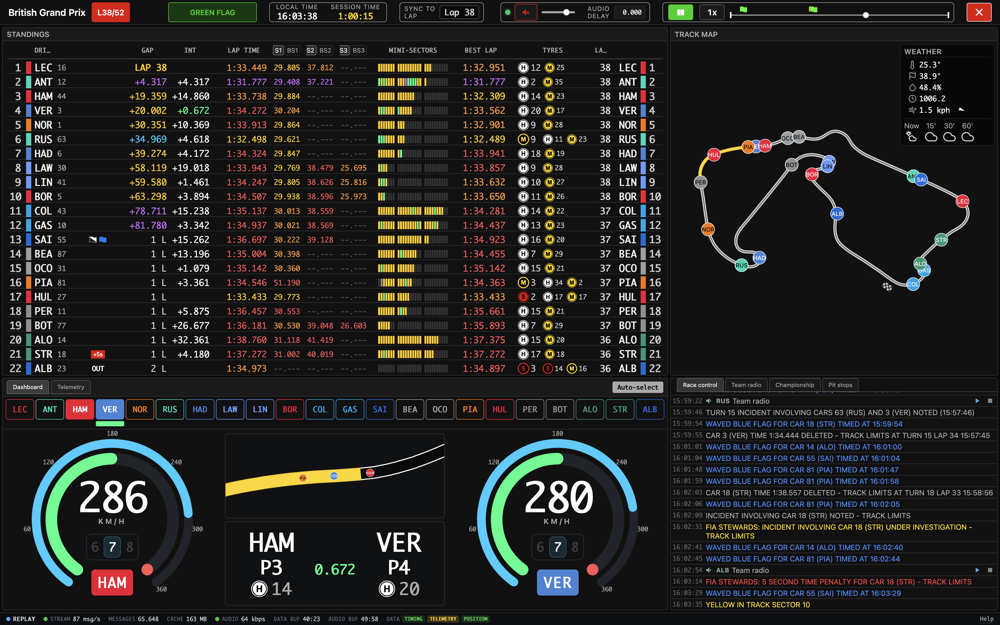

# F1Unleashed



A Formula 1 live-timing and replay application with synchronised audio commentary and per-session deep analysis.

> **Unofficial project — not affiliated with Formula 1 or the FIA.** F1Unleashed is a personal, non-commercial viewer and is not associated with, endorsed by, or affiliated with Formula 1, Formula One Licensing B.V., Formula One Management, or the FIA. See [Trademarks & disclaimer](#trademarks--disclaimer).

**Release 1.0.0** — 7 June 2026, the day of the 2026 Monaco Grand Prix: McLaren's 1000th Grand Prix start. McLaren's first-ever race was also a Monaco Grand Prix, in 1966 — so the day marked both 1000 races and 60 years of McLaren in Formula 1.

**Current release**: 2.0.0 "Spa-Francorchamps", 2026-07-16 — on the eve of the Belgian Grand Prix weekend.

For what it does and how it works, see [DOCUMENTATION.md](DOCUMENTATION.md). For a tour of the
interface, the in-app **user guide** (the **Help (?)** icon on the home page) is split into the
main window and one page per session type.

<!-- SCREENSHOT (new): the live Dashboard view in a race — two cars under a second apart with
     the zoomed mini track-map — as the hero image once captured. -->


---

## Built with Claude Code — analysis was human-driven

The implementation (= Python services, processors, JavaScript components, sync plumbing) was written with [Claude Code](https://claude.com/claude-code). The F1-domain reasoning — what to measure, what and how to classify, what to look out for, how to display the data, 3rd party services to overlay, etc. came from the human in charge. The model is the implementer; the human is the analyst.

---

## Requirements

### Tested environment

- macOS 15+ (= Sequoia / Tahoe). Linux + Windows should work but haven't been actively tested for the live-sync features.
- **Firefox** for the F1Unleashed UI (= reference browser; other modern browsers should work).

### Runtime

- Python 3.13 (= venv recommended).
- `ffmpeg` + `ffprobe` (= audio HLS capture + duration probing for the PDT side-car).
- A formula1.com subscription (= for live sessions; download of historic data may be available without a subscription).
- No `.env` is required — all configuration lives in an in-app settings dialog backed by a JSON store with defaults for every value (see Installation, step 3).

### Audio sync

No external setup required. F1Unleashed captures the commentary HLS feed alongside the data feed and anchors it to the broadcast `PROGRAM-DATE-TIME` of ffmpeg's exact first captured segment (byte-0 anchoring). The commentary aligns to the data clock automatically — for live and replay alike — without virtual loopbacks or cross-correlation. A **Delay** box next to the volume control (`ss.SSS`, ±) is available as a manual fallback should you ever want to nudge it (positive plays the commentary later, negative earlier).

### Weather radar

Uses [Rainbow.ai](https://rainbow.ai/) for precipitation-radar imagery (rendered through a blue intensity palette). A free API key (30,000 calls/month, no hourly cap) is sufficient for normal use.

---

## Installation

```bash
# 1. Clone
git clone <repo-url> f1unleashed && cd f1unleashed

# 2. Python environment
python3.13 -m venv venv
source venv/bin/activate
pip install -r requirements.txt

# 3. Start
./f1unleashed.sh start

# 4. Open
open http://localhost:1950           # 1950 = the year of the first F1 World Championship
```

Configuration is done in-app, not via `.env` (which is gone). Open the
**settings dialog** from the gear on the home-page footer (right side) to set:
the precipitation-radar API key (= Rainbow.ai); a push-notification webhook
(= ntfy/Discord/Slack) and which alerts to send; per-session-type capture
toggles (download/play commentary audio, download team radio, keep downloaded
files); team-radio auto-play; favourite drivers/teams; and the cache location.
Every value has a sensible default, so the app runs out of the box. The cache
folder defaults to an OS-appropriate app-data dir; changing it offers to move
the existing cache and requires a restart.

First-time login:

```bash
python -m app.cli.login          # browser-based F1 login
```

---

## Roadmap

The application covers Practice / Qualifying / Race in usable form today. Active development is focused on these next:


### Recently shipped (v2.0)

- **Live Dashboard view** — a focused two-driver view on the telemetry tile. In practice /
  qualifying: live gauges with a **lap-time forecast** (a projected lap time, updated as the
  driver runs). In the race: a **battle panel** (positions, interval, tyres, pit/close-gap
  indicators) with a **zoomed, self-centring mini track-map** that follows the chasing car.
- **Auto-select** — the app picks the two most interesting drivers for you, per session type
  (closest to finishing a push lap; the at-risk drivers in Q1/Q2; the fight for pole in Q3;
  the best on-track battle in the race), and re-picks as the session evolves.
- **Pecking-order predictor** — a predicted team ranking and pace from practice and qualifying
  running.
- **Pit-stop measurement** — every in-race stop with stationary time, total time lost,
  green/SC/VSC context, position change and rejoin-traffic flags, plus a pre-race pit-lane
  time-loss estimate.
- **Split user guide + player help** — the in-app guide is now one page per context, and a
  **Player help** pop-up (status-bar link) explains the controls without pausing playback.

### Recently shipped (v1.3)

- **Automatic audio sync** — commentary auto-anchors to the broadcast PDT of ffmpeg's first captured segment, so it aligns to the data clock with no manual step (the Delay box is now just a fallback).
- **Unified live/replay audio** — MSE playback; the server serves multi-segment (restarted) captures as one virtual stream, so live behaves exactly like replay.
- **Robust live-edge audio** — audio stays available at the live tail, and a capture stall no longer freezes the session.
- **Race start anchoring** — ENTER jumps to lights-out (the SYNC TO "Lap 1" marker) and resumes if paused. *(v2.0 replaced the OCR/screen-share video sync with the marker-based SYNC TO.)*

### Recently shipped (v1.2)

- **In-app settings** — a settings dialog (home-page footer) backed by a JSON store, replacing `.env` entirely.
- **Team radio replay** — F1 team-radio clips captured during live sessions and played back time-aligned, with commentary ducking.
- **Status footer + data-health monitor** — a bottom status bar showing live/replay, throughput, message count, cache size, audio bitrate, live download speeds, and per-stream timing/telemetry/position health.
- **Weather forecast** — a 15/30/60-minute forecast widget (captured live for replay) alongside the renamed Current Conditions tile.


### Coming up soon

- **Session summary / highlights** (= post-session recap: fastest lap, longest stint, biggest gap closes, position changes, podium).
- **Lift-and-coast** detection.
- **Tyre-saving** detection.
- **Pit windows** (SC / VSC opportunity detection).
- **Pit-strategy** predictions and simulations.
- **Dry/wet** tyre crossover identification.


### Coming up later

- Dockerised deploy.
- Robustness + reconnect logic for long sessions.
- Memory management improvements.

---

## Support the project

F1 Unleashed is a free, personal project built to make watching Formula 1 better. If it
improves your race weekends, you can support it with a coffee:

**[Buy me a coffee](https://buymeacoffee.com/f1unleashed)**

---

## Credits

This project would not exist without the work others have done in this space:

- **[FastF1](https://github.com/theOehrly/Fast-F1)** — Python toolkit for F1 data. Used for session schedule, event metadata, and as the canonical reference for many timing semantics.
- **[Undercut-f1](https://github.com/JustAman62/undercut-f1)** — open-source F1 live-timing analysis app. A constant reference for processor design and live-feed interpretation.
- **[MultiViewer API](https://api.multiviewer.app/)** — circuit metadata (= corners, marshal sectors, layout SVGs). The track maps are generated from this data.
- **[OpenF1](https://openf1.org/)** — schedule + meeting data with circuit info URLs.
- **[Rainbow.ai](https://rainbow.ai/)** — precipitation nowcast radar tiles.
- **[Formula 1](https://www.formula1.com/)** — the underlying timing feed, broadcast audio, and on-track data. F1Unleashed is a viewer + analysis layer, not a redistribution of any of the above.

---

## Trademarks & disclaimer

F1Unleashed is an unofficial, non-commercial project for personal use. It is **not** associated with, endorsed by, or affiliated with Formula 1, Formula One Licensing B.V., Formula One Management, the FIA, or any Formula 1 team, driver, or sponsor.

F1, FORMULA 1, FORMULA ONE, the F1 logo, FIA F1 WORLD CHAMPIONSHIP, GRAND PRIX and related marks are trademarks of Formula One Licensing B.V. Team, driver, sponsor, circuit, and tyre-supplier (e.g. Pirelli) names and marks are the property of their respective owners. They are used here only descriptively, to identify the sport and the data being displayed.

F1Unleashed does not redistribute Formula 1 timing data, broadcast audio, or video. It is a viewer/analysis layer meant to be run by a single user on their own machine, for data that user is entitled to access. See the [full copyright & usage note](DOCUMENTATION.md#disclaimer).

---

## License

[PolyForm Noncommercial 1.0.0](LICENSE). Use for personal, hobby, educational, or research purposes is welcome. Commercial use is not granted under this license. Attribution required.

Copyright © 2026 Nelson Sousa. Co-authored with Claude Code.
