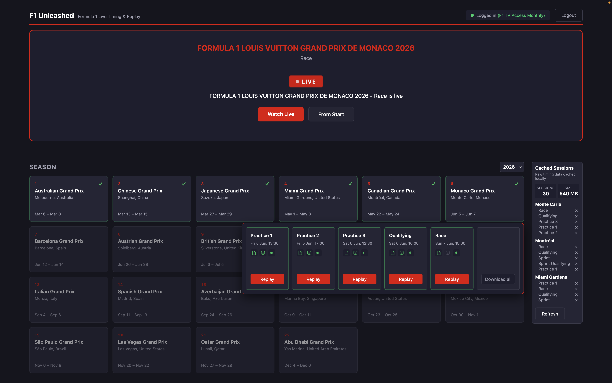
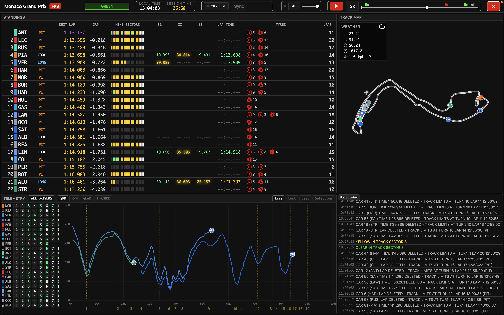
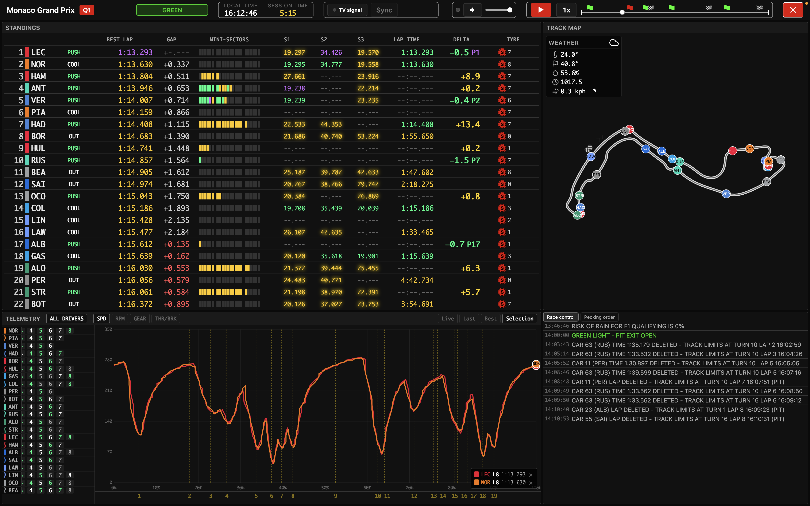
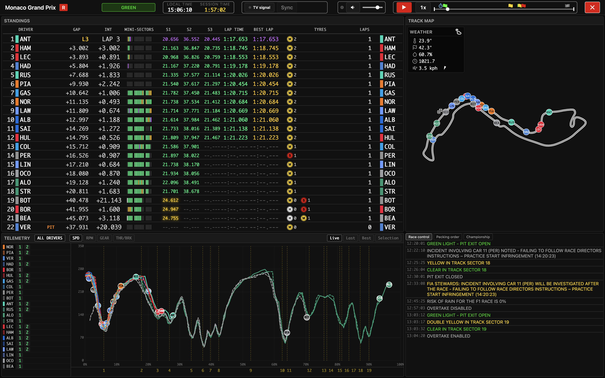

# F1Unleashed — User Guide

A walkthrough of what each part of the UI shows and does. Screenshots accompany each section.

---

## Main page

The landing page lists every Grand Prix weekend in the current season and the prior weekend's cached sessions, plus controls for login and live-capture status.

- **Race calendar** — one card per event. Past events are clickable and open the session popover; upcoming events appear faded.
- **Session popover** — opens beneath the event card and lists the FP / Q / Sprint / Race sessions for that weekend. Each session row offers:
    - **Download** — pull the raw F1 timing data for a finished session (= one-shot, runs in the background).
    - **Open** — launch the session view (= practice / qualifying / race) at speed 1×.
    - **Delete** — remove the cached session from disk.
- **Login button** — opens the browser-based F1 login. After login the token is stored at `~/Library/Application Support/fastf1/f1auth.json` for ~72 h.
- **Live-capture status** — shows when a live session is being captured automatically by the adaptive session monitor.
- **Footer** — the app name and version sit in the centre, a Help (?) icon on the left opens the in-app documentation page, and a settings gear on the right opens the settings dialog (see below).

### Settings dialog

Opened from the gear on the home-page footer (it is not available in the session window). All configuration lives here — there is no `.env` file. You can set: the precipitation-radar (Rainbow.ai) API key; a push-notification webhook (ntfy / Discord / Slack) and which alerts to send (session-live / pre-session / token-expiry) with a pre-session lead time; per-session-type capture toggles (download + play commentary audio, download team radio, keep downloaded files); team-radio auto-play; favourite drivers and teams; and the cache location. Changing the cache location offers to move the existing cache and requires a restart; a native folder-picker is provided.

---

## Practice view

Optimised for free practice: lots of timed lap context, pace classification, tyre-history, telemetry comparison.

- **Header** — local + session clock, track status, playback controls, audio controls.
- **Standings** — position, driver, lap type, best lap, gap to leader, mini-sectors, S1/S2/S3 times, last lap time, tyre history, number of laps.
- **Track map** -  track SVG with position of each driver, the Current Conditions weather panel, the rain radar overlay, and a short-range weather forecast widget (In 15' / 30' / 60', with rain probability for wet slots).
- **Telemetry** — multi-driver SPD / RPM / GEAR / THR-BRK traces with per-driver lap-list. Can show live telemetry trace, last lap, best lap and a selection of laps for comparison; in qualifying a toggle groups the lap-list by part (Q1/Q2/Q3). Corner labels along the x-axis match the circuit map.
- **Race control** — RC message stream (with team-radio clips interleaved by time) plus a **Team Radio** tab listing every clip. Each clip has Play / Stop buttons; playing a clip mutes the commentary for its duration and then restores it.

---

## Qualifying view

Practice-like layout plus Q-specific features: knockout-zone indicator, lap time prediction, and team's predicted qualifying pace.

- **Standings** — for drivers in elimination zone, gap is shown to the driver on the bubble. Only current tyre is shown. During a qualifying attempt the driver's delta to their best lap is shown live with the positions it would gain; once the lap completes, the actual delta and positions gained are shown.
- **Pecking-order tab** in race-control, the predicted ranking of teams and their gaps is shown on a separate tab in the lower right tile.

---

## Race view

Optimised for the race: gaps to leader and to driver ahead, tyre history, penalties, and championship standings.

- **Standings** — similar to the Practice view, but showing gaps to leader and driver ahead. Also shows blue flags, penalties under investigation and imposed, black and white flags.
- **Race control** — tabs:
    1. **RCM** — live RC message stream, with team-radio clips interleaved by time.
    2. **Team Radio** — every captured team-radio clip, each with Play / Stop buttons (playing a clip ducks the commentary).
    3. **Pecking order** — pre-race predicted team rank and pace.
    4. **Championship** — provisional driver + constructor standings updated according to current standings.

---

## Common controls

- **Scrubber** — drag to seek to any point in the session. Click an event marker to jump to ~60 s before that event. Relevant events: 2' notice before race; session start; session finished; safety car/virtual safety car; green flags; red flags.
- **Live button** (live sessions only) — snap to the latest state.
- **Speed** — 1× during live; 1×-50× during replay.
- **Audio controls** — mute, volume, sync indicator (green = audio is sync'd; yellow = audio seeking/loading; red = audio unavailable)
- **Status footer** — a slim bar at the bottom of the player showing the live/replay mode, stream throughput (msg/s), total messages, on-disk cache size, audio bitrate, live download speeds (live sessions only), and a data-health monitor: three boxes (TIMING / TELEMETRY / POSITION) that turn green/yellow/orange/red as on-track drivers lose timing, telemetry or position data. Hovering a coloured box lists the affected drivers.
- **TV controls** (coming soon) - choose a window where TV broadcast is on and click the "Sync" button to synchronise TV, data and audio automatically.
